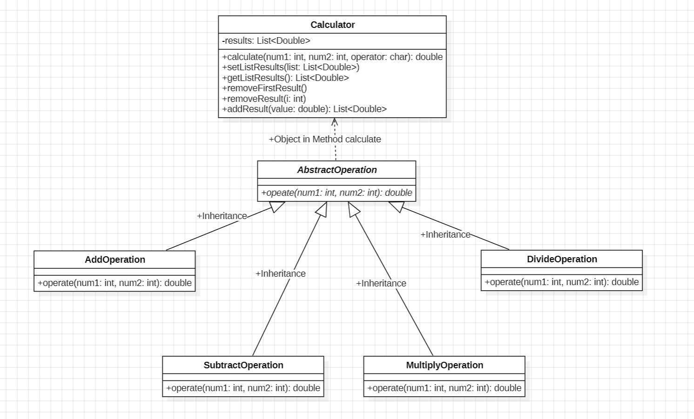

# [Assignment][Ch2] 계산기
- 클래스를 사용하지 않은 계산기 (절차지향 프로그래밍)
- 클래스를 사용한 계산기 (객체지향 프로그래밍)

 

## 1. 요구사항 분석 및 정의 & 설계
<https://1step2dream.tistory.com/8>

 

## 2. 구현
### 1) 클래스를 활용하지 않은 계산기
<https://1step2dream.tistory.com/10>
#### &ensp;CalculatorWithoutClass 클래스
- 절차 지향적 설계

 

### 2) 클래스를 활용한 계산기
<https://1step2dream.tistory.com/11>

#### &ensp;Calculator 클래스
- double calculate(int, int, char) : 사칙연산 수행 후, 결과값 반환 메서드
- void setListResults(List<Double>) : Setter
- List<Double> getListResults() : Getter
- removeFirstResult(): 저장된 연산 결과 중 가장 먼저 저장된 데이터를 삭제하는 메서드
- removeResult(int i): 저장된 연산 결과 중 i번째 결과값을 삭제하는 메서드

#### &ensp;AbstractOperation 클래스
- 연산 기능 담당 추상 클래스

- double operate(int, int) : 연산 기능 담당 추상 메서드

#### &ensp;AddOperation 클래스
- 덧셈 연산 담당 클래스

- double operate(int, int) : 덧셈 연산 기능 메서드

#### &ensp;SubtractOperation 클래스
- 뺄셈 연산 담당 클래스

- double operate(int, int) : 뺄셈 연산 기능 메서드

#### &ensp;MultiplyOperation 클래스
- 곱셈 연산 담당 클래스

- double operate(int, int) : 곱셈 연산 기능 메서드

#### &ensp;DivideOperation 클래스
- 나눗셈 연산 담당 클래스

- double operate(int, int) : 나눗셈 연산 기능 메서드

---

#### &ensp;App 클래스
- CalculatorWithoutClass 클래스를 기반으로 생성된 클래스
- 계산기의 전체적인 입출력 및 기능 구현 확인
- main 메서드 포함